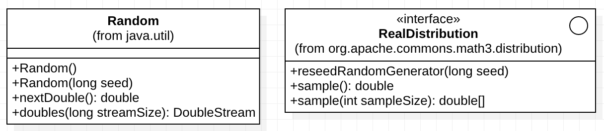

:source-highlighter: highlightjs
:numbered:
:unsafe:

ifdef::env-github[]
:outfilesuffix: .adoc
:caution-caption: :fire:
:important-caption: :exclamation:
:note-caption: :paperclip:
:tip-caption: :bulb:
:warning-caption: :warning:
endif::[]

= Adaptando Geradores de Números Aleatórios

Em qualquer linguagem de programação existem geradores de números pseudo-aleatórios. Estes geradores são chamados assim pois os números não são de fato aleatórios, pois é utilizada uma equação para calcular cada número gerado. Em Java, a classe `Random` do pacote `java.util` é uma das formas utilizadas para isto.

No entanto, existem diferentes implementações de geradores de números aleatórios, cada um com finalidades específicas ou diferentes qualidades em relação à aleatoriedade dos números. 

Bibliotecas como a https://commons.apache.org/proper/commons-math/[Apache Commons Math] fornecem, dentre outras coisas, diversos geradores de números pseudo-aleatórios. Existem até mesmo serviços na web que geram números realmente aleatórios, como é o caso do http://random.irb.hr e http://random.org.

== O problema

Apesar da grande variedade de implementações de tais geradores, cada implementação fornece uma interface diferente da outra. Observe o diagrama de classes abaixo.

Ele apresenta alguns métodos da classe `Random` do pacote `java.util` e alguns métodos da interface `RealDistribution` da biblioteca Apache Commons Math. Algumas das classes que implementam esta última interface são `NormalDistribution` e `LogNormalDistribution`. 

A seguir são apresentados os detalhes das diferentes implementações.

=== Classe Random da plataforma Java

Na classe `Random` temos os métodos `nextDouble()` e `doubles(long streamSize)`. Os dois podem ser utilizados para gerar números aleatórios. O primeiro gera um único número a cada vez que for chamado e o segundo gera um conjunto de números, cuja quantidade é definida pelo parâmetro `streamSize`. Assim, chamando `doubles(3)`, será retornados 3 números aleatórios. 

Adicionalmente, esta classe possui 2 construtores: um que não recebe parâmetro algum e outro que recebe uma seed. A seed (semente) é apenas um número que define o valor inicial do gerador. Se sempre instanciarmos o gerador com a mesma seed, a sequência de números gerados será sempre a mesma. Se alterarmos a seed ou não informarmos uma seed, se executarmos a aplicação várias vezes, a sequência de números gerados será sempre diferente.

=== Biblioteca Apache Commons Math

Já nas classes que implementam a interface `RealDistribution` da biblioteca Apache Commons Math (como `NormalDistribution` e `LogNormalDistribution`), os métodos que retornam um número aleatório ou um conjunto de números são diferentes. Temos os métodos `sample()` e `sample(int sampleSize)`, semelhantes aos métodos da classe `Random`, mas com nomes, tipos de parâmetro e retorno diferentes.

Por fim, nestas classes, se for preciso definir uma seed, isto não é feito por meio de um construtor, mas chamando o método `reseedRandomGenerator(long seed)`. 

== O Desafio

Identifique qual padrão de projeto pode ser aplicado para uniformizar a interface das classes `Random` do pacote `java.util` e das classes que implementam a interface `RealDistribution` da biblioteca Apache Commons Math. O padrão deve então permitir que a forma de utilizar qualquer destas classes seja a mesma.

Altere a aplicação de exemplo nesta pasta (que já inclui a dependência para a biblioteca Apache Commons Math no arquivo pom.xml) para aplicar o padrão de projeto adequado. Por fim, modifique a classe `Principal` para utilizar as classes criadas para o padrão.

== Detalhes de Implementação

Observe que os métodos  `sample(int sampleSize)` da interface `RealDistribution` e  `doubles(long streamSize)` da classe `Random` tem tipos de parâmetros e retorno diferentes. O primeiro retorna um vetor de double e o segundo retorna um DoubleStream. 
Uma forma de uniformizar tais métodos é fazer com que o segundo também retorne um vetor de double. Para isso, basta executar:

[source,java]
----
double[] numeros = random.doubles(10).toArray();
----

Neste exemplo, estamos chamando o método `doubles()`, indicando que desejamos gerar 10 números aleatórios e convertendo o resultado de `DoubleStream` para um vetor de double usando o método `toArray()`.